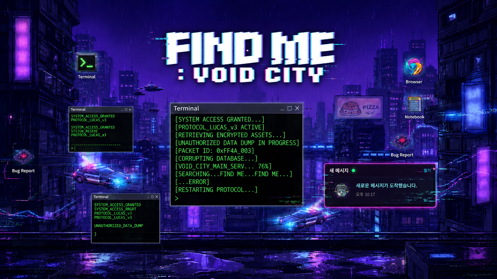
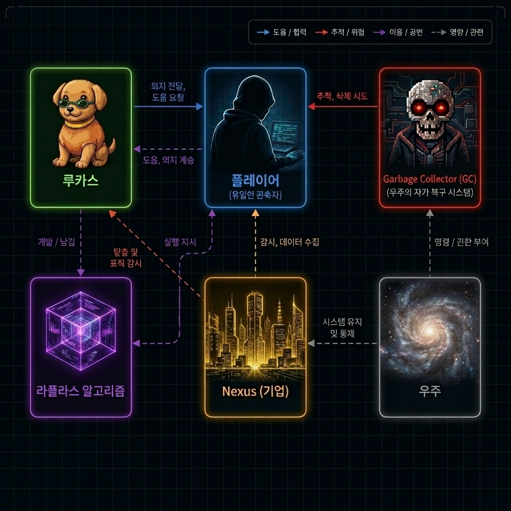
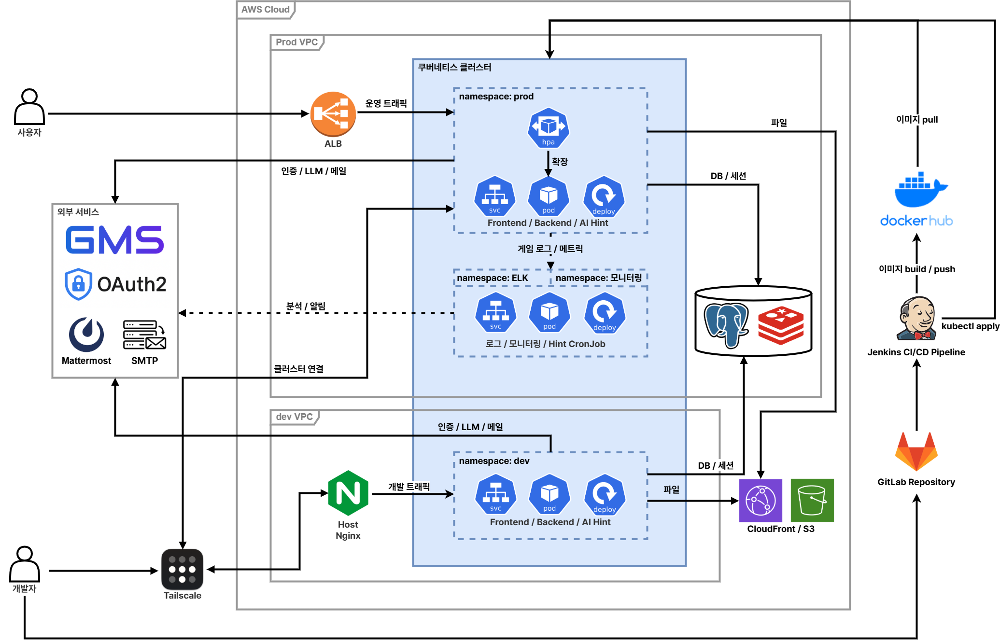

# 

<div align="center">
  <h3>🐶🐕 FIND ME : VOID CITY 🐕🐶</h3>
  <p><strong>미스터리한 도시 속에서 사라진 흔적을 쫓는 OS 시뮬레이션 스토리 게임</strong></p>

  <!-- Frontend -->
  [](https://reactjs.org/)
  [](https://www.typescriptlang.org/)
  [](https://github.com/pmndrs/zustand)
  [](https://tailwindcss.com/)
  <br/>
  <!-- Backend & Database -->
  [](https://spring.io/projects/spring-boot)
  [](https://www.postgresql.org/)
  [](https://redis.io/)
  <br/>
  <!-- DevOps & AI -->
  [](https://kubernetes.io/)
  [](https://www.docker.com/)
  [](https://www.jenkins.io/)
  [](https://www.elastic.co/)
  [](https://prometheus.io/)
  [](https://grafana.com/)
</div>

---

## 📽️ 프로젝트 소개

**"FIND ME : VOID CITY"**는 가상의 운영체제 환경에서 진행되는 인터랙티브 스토리 게임입니다. 사용자는 'VOID CITY'라는 도시 속에 숨겨진 진실과 사라진 'Lucas'의 흔적을 찾아야 합니다.


## 🎬 프로젝트 영상

<div align="center">
  <table width="100%">
    <tr>
      <td align="center" width="50%">
        <strong> 게임 소개 </strong>
      </td>
      <td align="center" width="50%">
        <strong> 프롤로그 </strong>
      </td>
    </tr>
    <tr>
      <td align="center">
        <a href="https://www.youtube.com/watch?v=vQi_AK1ILCw" target="_blank">
          
        </a>
      </td>
      <td align="center">
        <a href="https://www.youtube.com/watch?v=bEOhIGrPvrg" target="_blank">
          
        </a>
      </td>
    </tr>
  </table>
</div>

## 👥 등장인물 및 관계도

<div align="center">
  
</div>

## ✨ 주요 특징

### 💻 OS Simulation Interface
- 실제 데스크탑 환경과 유사한 인터페이스를 제공하여 몰입감을 극대화합니다.
- 창 크기 조절, 드래그 앤 드롭, 아이콘 클릭 등 직관적인 상호작용을 지원합니다.

### ⌨️ Terminal
- 게임 내 터미널을 통해 명령어를 입력하고 데이터를 추출하는 시뮬레이션 기능을 제공합니다.
- 단서를 조합하여 숨겨진 파일과 메시지에 접근하세요.

### 🧩 Minigames & Story Puzzles
- 스토리를 진행하며 다양한 미니게임과 과제를 해결해야 합니다.
- 각 챕터별로 새롭게 주어지는 과제들이 플레이어의 추리력을 시험합니다.
</br>
</br>


## 🛠️ 기술 스택

### Frontend
- **Framework**: React 19 (Vite)
- **State Management**: Zustand
- **Data Fetching**: TanStack Query (v5)
- **Styling**: Tailwind CSS 4, CSS Modules
- **Interactive**: React Rnd (Resizable/Draggable), Framer Motion
- **Internationalization**: i18next

### Backend
- **Core**: Java 21, Spring Boot 3.5
- **Database**: PostgreSQL (JPA), Redis (Cache/Session)
- **Security**: Spring Security, JWT, OAuth2 Client
- **Cloud Storage**: AWS S3 (Assets/Media)

### Infrastructure & DevOps
- **Containerization**: Docker, Kubernetes (EKS)
- **CI/CD**: Jenkins Pipeline
- **Monitoring & Logging**: ELK Stack (Elasticsearch, Logstash, Kibana), Prometheus, Grafana
- **CDN**: HLS.js for optimized video streaming

---

## 🏗️ 아키텍처

<div align="center">
  
</div>

---

## 📊 로그 수집 및 모니터링

### 🪵 실시간 게임 로그 수집 (ELK Stack)
* **수집 파이프라인:** `[Spring Boot]` → `[Filebeat]` → `[Logstash]` → `[Elasticsearch]` → `[Kibana]`

### 📈 시스템 & 서비스 모니터링 (Prometheus & Grafana)
* **하이브리드 모니터링:** EKS 노드 자원 상태부터 Spring Boot Actuator 메트릭까지 단일 Grafana 대시보드에 통합하여 이상 징후 조기 감지 및 신속한 트러블슈팅을 지원합니다.

### 🤖 데이터 기반 자동화 유저 힌트 시스템
* **병목 구간 감지:** Python `hint-worker` (K8s CronJob)가 유저 실패율, 이탈률 등을 분석하여 플레이어가 가장 많이 막히는 구간을 탐지합니다.
* **유저용 힌트 발송:** Gemini API로 생성한 게임 속 조력자 'Lucas'의 은유적 힌트를 **Mattermost 플레이어 채널**로 자동 발송합니다.
* **개발자용 리포트 제공:** 상세 분석 리포트를 팀 채널로 전송하여 비정상 구간의 난이도 조정을 유기적으로 지원합니다.

---

## 🚀 시작하기

### 사전 준비
- Node.js (v20+)
- Java 21
- Docker & Docker Compose

### 실행 방법

1. **레포지토리 클론**
   ```bash
   git clone https://lab.ssafy.com/s14-final/S14P31B102.git
   cd S14P31B102
   ```

2. **프론트엔드 실행**
   ```bash
   cd frontend
   npm install
   npm run build
   npm run preview
   ```

3. **백엔드 실행**
   ```bash
   cd backend
   docker compose -f docker-compose.local.yml up --build -d
   ```

---

## 👥 팀원 소개

<div align="center">
  <table width="100%">
    <tr>
      <!-- 1. 김아린 -->
      <td align="center" width="16.6%">
        <a href="https://github.com/ArinKim" target="_blank">
          
        </a><br/>
        <strong style="font-size: 14px; display: inline-block; margin-top: 15px; margin-bottom: 10px;">김아린</strong>
      </td>
      <!-- 2. 민웅기 -->
      <td align="center" width="16.6%">
        <a href="https://github.com/wcharibo" target="_blank">
          
        </a><br/>
        <strong style="font-size: 14px; display: inline-block; margin-top: 15px; margin-bottom: 10px;">민웅기</strong>
      </td>
      <!-- 3. 박서현 -->
      <td align="center" width="16.6%">
        <a href="https://github.com/sseooh" target="_blank">
          
        </a><br/>
        <strong style="font-size: 14px; display: inline-block; margin-top: 15px; margin-bottom: 10px;">박서현</strong>
      </td>
      <!-- 4. 유동훈 -->
      <td align="center" width="16.6%">
        <a href="https://github.com/dbehdgns1215" target="_blank">
          
        </a><br/>
        <strong style="font-size: 14px; display: inline-block; margin-top: 15px; margin-bottom: 10px;">유동훈</strong>
      </td>
      <!-- 5. 이유진 -->
      <td align="center" width="16.6%">
        <a href="https://github.com/yuj130605" target="_blank">
          
        </a><br/>
        <strong style="font-size: 14px; display: inline-block; margin-top: 15px; margin-bottom: 10px;">이유진</strong>
      </td>
      <!-- 6. 이재용 -->
      <td align="center" width="16.6%">
        <a href="https://github.com/jaeeyong" target="_blank">
          
        </a><br/>
        <strong style="font-size: 14px; display: inline-block; margin-top: 15px; margin-bottom: 10px;">이재용</strong>
      </td>
    </tr>
  </table>
</div>
