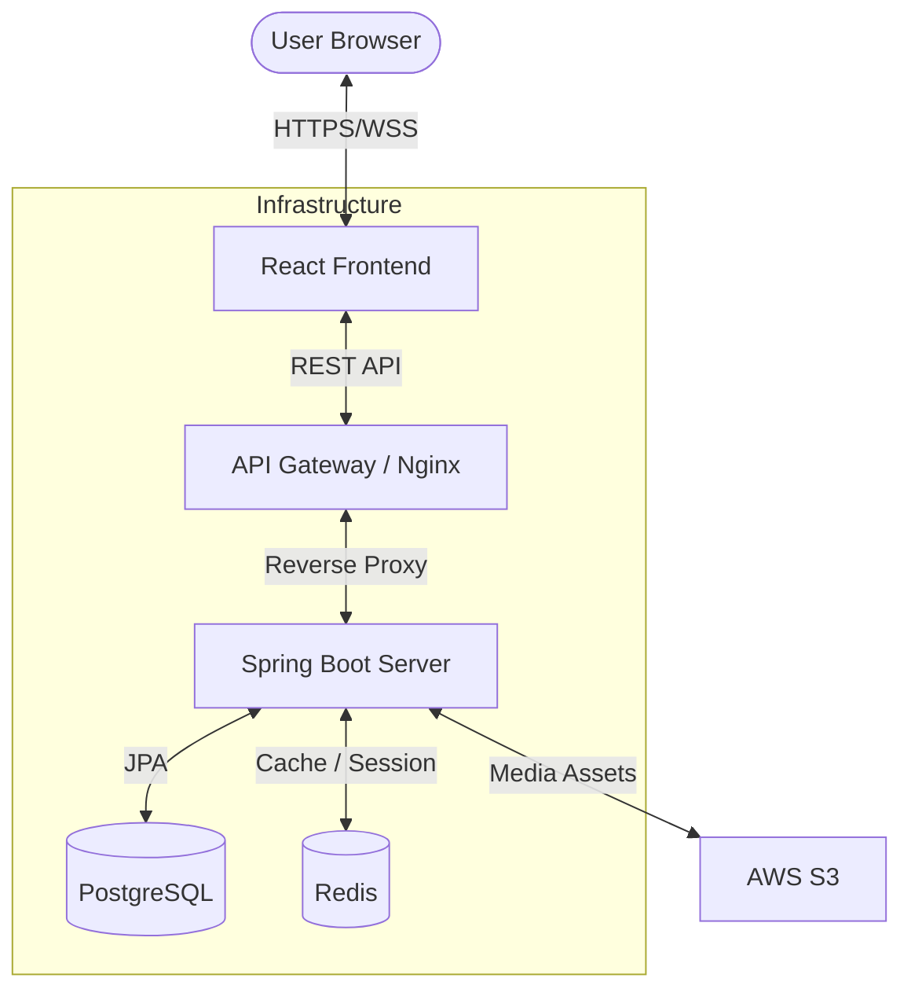

# 

<div align="center">
  <h3>🌑 FIND ME : VOID CITY 🌑</h3>
  <p><strong>미스터리한 도시 속에서 사라진 흔적을 쫓는 OS 시뮬레이션 스토리 게임</strong></p>

  [](https://reactjs.org/)
  [](https://spring.io/projects/spring-boot)
  [](https://kubernetes.io/)
  [](https://tailwindcss.com/)
  [](https://github.com/pmndrs/zustand)
</div>

---

## 📽️ 프로젝트 소개

**"FIND ME : VOID CITY"**는 가상의 운영체제 환경에서 진행되는 인터랙티브 스토리 게임입니다. 사용자는 'VOID CITY'라는 도시 속에 숨겨진 진실과 사라진 'Lucas'의 흔적을 찾아야 합니다.

## ✨ 주요 특징

### 💻 OS Simulation Interface
- 실제 데스크탑 환경과 유사한 인터페이스를 제공하여 몰입감을 극대화합니다.
- 창 크기 조절, 드래그 앤 드롭, 아이콘 클릭 등 직관적인 상호작용을 지원합니다.

### ⌨️ Terminal
- 게임 내 터미널을 통해 명령어를 입력하고 데이터를 추출하는 시뮬레이션 기능을 제공합니다.
- 단서를 조합하여 숨겨진 파일과 메시지에 접근하세요.

### 🧩 Minigames & Story Puzzles
- 스토리를 진행하며 다양한 미니게임과 과제를 해결해야 합니다.
- 각 챕터별로 새롭게 주어지는 과제들이 플레이어의 추리력을 시험합니다.
</br>
</br>
---

## 🛠️ 기술 스택

### Frontend
- **Framework**: React 19 (Vite)
- **State Management**: Zustand
- **Data Fetching**: TanStack Query (v5)
- **Styling**: Tailwind CSS 4, CSS Modules
- **Interactive**: React Rnd (Resizable/Draggable), Framer Motion
- **Internationalization**: i18next

### Backend
- **Core**: Java 21, Spring Boot 3.5
- **Database**: PostgreSQL (JPA), Redis (Cache/Session)
- **Security**: Spring Security, JWT, OAuth2 Client
- **Cloud Storage**: AWS S3 (Assets/Media)

### Infrastructure & DevOps
- **Containerization**: Docker, Kubernetes (EKS)
- **CI/CD**: Jenkins Pipeline
- **Monitoring & Logging**: ELK Stack (Elasticsearch, Logstash, Kibana), Prometheus, Grafana
- **CDN**: HLS.js for optimized video streaming

---

## 🏗️ 아키텍처



---

## 🚀 Getting Started

### Prerequisites
- Node.js (v20+)
- Java 21
- Docker & Docker Compose

### Running Locally

1. **Clone the repository**
   ```bash
   git clone https://lab.ssafy.com/s14-final/S14P31B102.git
   cd S14P31B102
   ```

2. **Frontend Setup**
   ```bash
   cd frontend
   npm install
   npm run build
   npm run preview
   ```

3. **Backend Setup**
   ```bash
   cd backend
   docker compose -f docker-compose.local.yml up --build -d
   ./gradlew bootRun
   ```

---
