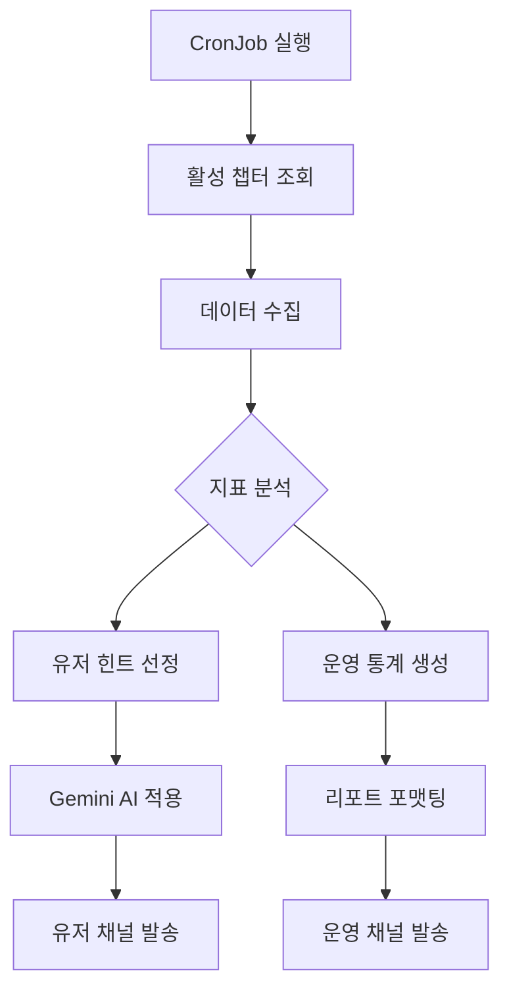

# 📊 운영 리포트 데이터 산출 및 시스템 흐름 가이드

이 문서는 `hint-worker`가 생성하는 운영 리포트의 데이터 계산 로직과 전체적인 시스템 흐름을 설명합니다.

---

## 1. 전체 시스템 흐름 (System Flow)

---

## 2. 데이터 계산 로직 (Metrics Calculation)

모든 데이터는 Elasticsearch의 **집계(Aggregation) 기능**을 통해 실시간으로 산출됩니다.

### ① 참여 지표
- **총 참여 유저**: 최근 지정된 기간(1일 또는 7일) 동안 로그에 기록된 중복되지 않은 `session_id`의 총 개수입니다.
- **총 액션 발생**: 해당 기간 동안 발생한 전체 로그 라인(문서)의 총 합계입니다.

### ② 평균 플레이 시간 (Average Play Time)
- **계산 방식**: 
    1. 동일한 `session_id`를 가진 로그들을 그룹화합니다.
    2. 각 그룹 내에서 **가장 마지막 로그 시간(max_ts)**과 **가장 처음 로그 시간(min_ts)**의 차이를 구합니다. (`duration = max - min`)
    3. 모든 세션의 `duration` 합계를 전체 세션 수로 나눕니다.
- **단위**: 분(Minute) 단위로 리포트됩니다.

### ③ 성공률 (Success Rate)
- **대상**: 특정 노드(Stage)에 도달한 유저들의 액션
- **공식**: `(성공 횟수 / (성공 횟수 + 실패 횟수)) * 100`
- **의미**: 유저가 해당 단계의 명령어나 퍼즐을 얼마나 정확하게 해결했는지를 나타냅니다.

### ④ 이탈률 (Churn Rate)
- **핵심 지표**: 유저가 특정 단계에서 게임을 포기했는지를 추정합니다.
- **공식**: `((특정 노드 도달 유저 수 - 해당 노드 성공 유저 수) / 특정 노드 도달 유저 수) * 100`
- **해석**: 이 수치가 높을수록 해당 단계의 난이도가 너무 높거나, 유저가 무엇을 해야 할지 몰라 접속을 종료했을 가능성이 높습니다.

---

## 3. 리포트 비교 분석 (Comparison Logic)

리포트는 **어제(1d)**와 **주간(7d)** 데이터를 대조하여 제공합니다.

| 지표 | 어제(Yesterday) | 주간(Weekly) |
| :--- | :--- | :--- |
| **수집 범위** | 최근 24시간 | 최근 7일 |
| **활용 목적** | 신규 이슈/장애 모니터링 | 장기적인 병목 구간 파악 |
| **비교 포인트** | 전일 대비 유저 유입 변동 | 특정 노드의 난이도 지속성 |

---

## 4. 자동 경고 시스템 (Automatic Warning)

리포트 하단의 **"주요 병목 포인트"** 섹션은 다음 조건에 따라 자동으로 생성됩니다.
- 특정 노드의 **실패 횟수가 5회 이상**이면서,
- **성공률이 50% 미만**인 경우
- "가이드 보강이 필요할 수 있습니다"라는 제언을 리포트에 포함합니다.
