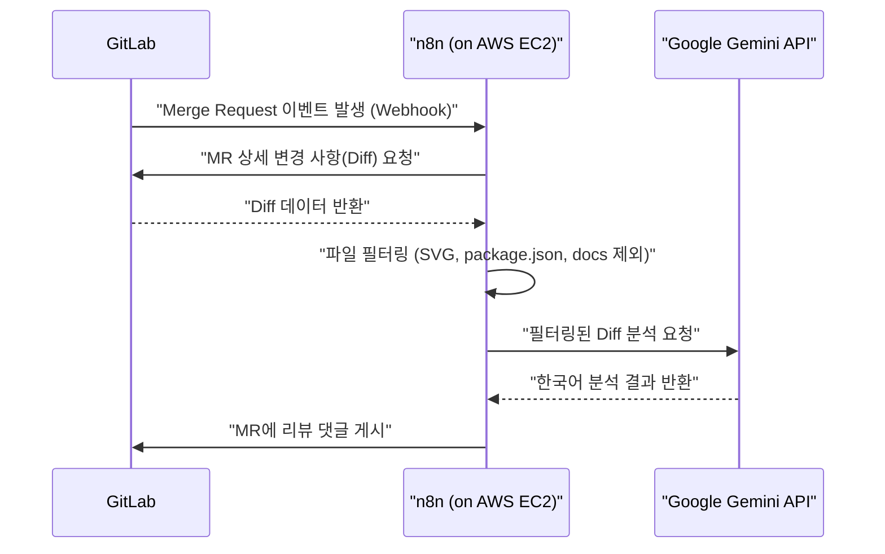

# AI 자동 코드 리뷰 시스템 구축 가이드 (GitLab + n8n + Gemini)

이 문서는 AWS EC2 프리티어 환경에서 n8n과 Google Gemini API를 사용하여 GitLab Merge Request(MR)에 대해 자동으로 AI 코드 리뷰를 수행하는 시스템의 구축 방법을 설명합니다.

## 시스템 아키텍처 및 흐름



---

## 1. 서버 환경 구성 (AWS EC2 프리티어)

이 가이드는 **Ubuntu 22.04 LTS** 운영체제를 기준으로 작성되었습니다. 다른 리눅스 배포판(Amazon Linux 등)을 사용하셔도 무방하나, 패키지 관리자(`apt` vs `dnf`)나 서비스 관리 명령어에 차이가 있을 수 있습니다.

EC2 프리티어(t2.micro/t3.micro)는 RAM이 1GB로 제한적이므로, 안정적인 운영을 위해 **Swap 메모리 설정**과 **Docker** 기반 설치를 수행합니다.

### 1.1 Swap 메모리 설정 (2GB 용량 권장)
```bash
sudo fallocate -l 2G /swapfile
sudo chmod 600 /swapfile
sudo mkswap /swapfile
sudo swapon /swapfile
echo '/swapfile none swap sw 0 0' | sudo tee -a /etc/fstab
```

### 1.2 Docker 설치 및 n8n 실행
```bash
# Docker 설치
curl -fsSL https://get.docker.com -o get-docker.sh
sudo sh get-docker.sh

# n8n 컨테이너 실행 (재부팅 시 자동 시작 및 HTTP 허용 설정)
sudo docker run -d --restart always --name n8n -p 5678:5678 -e N8N_SECURE_COOKIE=false -v ~/.n8n:/home/node/.n8n n8nio/n8n
```

### 1.3 보안 그룹(Security Group) 설정
AWS 콘솔에서 다음 포트를 개방해야 합니다.
- **Port**: `5678` (TCP) | **Source**: `0.0.0.0/0` (대시보드 접속용)

---

## 2. API 자격 증명 준비

### 2.1 Google Gemini API
- [Google AI Studio](https://aistudio.google.com/)에서 API Key를 발급받습니다.
- **무료 티어 기준**: 15 RPM, 1500 RPD (개인 프로젝트용으로 충분)

### 2.2 GitLab Access Token (Personal or Project)
- GitLab 설정 > Access Tokens에서 토큰을 생성합니다.
- **Role**: `Developer` (코드 읽기 및 댓글 작성이 가능한 권한)
- **Scopes**: `api` 체크 (프로젝트의 모든 REST API 접근 권한)
- **주의**: 생성된 토큰 값은 한 번만 노출되므로 즉시 복사하여 n8n 설정에 사용하세요.

---

## 3. n8n 워크플로우 구성

### 3.1 워크플로우 가져오기
제공된 `n8n_workflow.json` 파일의 내용을 복사하여 n8n 대시보드에 붙여넣습니다.

### 3.2 노드별 세부 설정
1.  **GitLab Webhook**: 이 노드에서 생성된 Webhook URL을 복사하여 GitLab 프로젝트의 **Settings > Webhooks**에 등록합니다 (`Merge request events` 체크).
2.  **Fetch MR Diffs**: GitLab API를 호출하여 변경 사항을 가져옵니다. `PRIVATE-TOKEN` 헤더에 발급받은 토큰을 입력합니다.
3.  **Filter & Combine (Code Node)**: 다음 파일들을 분석에서 자동 제외합니다.
    - `.svg`
    - `package.json`, `package-lock.json`, `yarn.lock`
    - `docs/` 경로 및 `*.md` 파일
4.  **Google Gemini**: Gemini 1.5 Flash 모델을 사용하여 한국어로 분석하도록 설정된 시스템 프롬프트가 포함되어 있습니다.
5.  **Post MR Comment**: 분석된 결과를 GitLab MR의 댓글로 게시합니다.

---

## 4. 모니터링 및 테스트

- **테스트**: 신규 브랜치에서 코드를 수정 후 MR을 생성하면 n8n의 **Execution** 탭에서 워크플로우 진행 상황을 실시간으로 확인할 수 있습니다.
- **데이터 프라이버시**: 무료 티어 사용 시 코드가 학습에 사용될 수 있음에 유의하십시오.

---

## 요약
이 시스템은 추가 비용 없이 EC2 프리티어 환경에서 강력한 AI 코드 리뷰 자동화를 제공합니다. 서버가 꺼지더라도 Docker의 `restart always` 옵션 덕분에 자동으로 복구됩니다.
